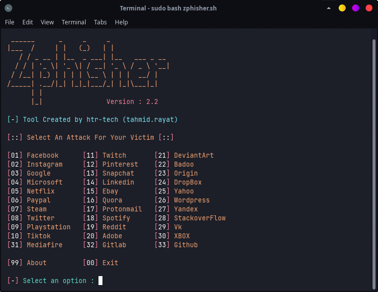

### Features

- Latest and updated login pages.
- Beginners friendly
- Multiple tunneling options
  - Localhost
  - Cloudflared
  - LocalXpose
- Mask URL support 
- Docker support

##

### Installation

- Just, Clone this repository -
  ```
  git clone --depth=1 https://github.com/RuchinHimasha/TechRuchin.git
  ```

- Now go to cloned directory and run `TechRuchin.sh` -
  ```
  $ cd TechRuchin
  $ bash TechRuchin.sh
  ```

- On first launch, It'll install the dependencies and that's it. ***TechRuchin*** is installed.

##

### Installation (Termux)
You can easily install TechRuchin in Termux by using tur-repo
```
$ pkg install tur-repo
$ pkg install TechRuchin
$ TechRuchin
```
### A Note : 
***Termux discourages hacking*** .. So never discuss anything related to *TechRuchin* in any of the termux discussion groups. For more check : [wiki](https://wiki.termux.com/wiki/Hacking)

##

<p align="left">
  <a href="https://shell.cloud.google.com/cloudshell/open?cloudshell_git_repo=https://github.com/htr-tech/TechRuchin.git&tutorial=README.md" target="_blank"></a>
</p>

##

### Installation via ".deb" file

- Download `.deb` files from the [**Latest Release**](https://github.com/htr-tech/TechRuchin/releases/latest)
- If you are using ***termux*** then download the `*_termux.deb`

- Install the `.deb` file by executing
  ```
  apt install <your path to deb file>
  ```
  Or
  ```
  $ dpkg -i <your path to deb file>
  $ apt install -f
  ```

##

### Run on Docker

- Docker Image Mirror:
  - **DockerHub** : 
    ```
    docker pull htrtech/TechRuchin
    ```
  - **GHCR** : 
    ```
    docker pull ghcr.io/htr-tech/TechRuchin:latest
    ```

- By using the wrapper script [**run-docker.sh**](https://raw.githubusercontent.com/htr-tech/TechRuchin/master/run-docker.sh)

  ```
  $ curl -LO https://raw.githubusercontent.com/htr-tech/TechRuchin/master/run-docker.sh
  $ bash run-docker.sh
  ```
- Temporary Container

  ```
  docker run --rm -ti htrtech/TechRuchin
  ```
  - Remember to mount the `auth` directory.

##

<details>
  <summary><h3>Dependencies</h3></summary>

<b>TechRuchin</b> requires following programs to run properly - 
- `git`
- `curl`
- `php`

> All the dependencies will be installed automatically when you run **TechRuchin** for the first time.
</details>

<details>
  <summary><h3>Tested on</h3></summary>

- **Ubuntu**
- **Debian**
- **Arch**
- **Manjaro**
- **Fedora**
- **Termux**
</details>

##

<h3 align="center"><i>:: Workflow ::</i></h3>
<p align="center">

</p>

##

### Find Me on:
<p align="left">
  <a href="https://tahmidrayat.is-a.dev" target="_blank"></a>
  <a href="https://github.com/htr-tech" target="_blank"></a>
</p>


### *Thanks to all contributors*:

<table>
  <tr align="center">
    <td><a href="https://github.com/1RaY-1"><br /><sub><b>1RaY-1</b></sub></a></td>
    <td><a href="https://github.com/adi1090x"><br /><sub><b>Aditya Shakya</b></sub></a></td>
    <td><a href="https://github.com/AliMilani"><br /><sub><b>Ali Milani</b></sub></a></td>
    <td><a href="https://github.com/Meht-evaS"><br /><sub><b>AmnesiA</b></sub></a></td>
    <td><a href="https://github.com/KasRoudra"><br /><sub><b>KasRoudra</b></sub></a></td>
   <td><a href="https://github.com/MoisesTapia"><br /><sub><b>Moises Tapia</b></sub></a></td>
  </tr>
  <tr align="center">
   <td><a href="https://github.com/E343IO"><br /><sub><b>Mr.Derek</b></sub></a></td>
    <td><a href="https://github.com/BDhackers009"><br /><sub><b>Mustakim Ahmed</b></sub></a></td>
    <td><a href="https://github.com/sepp0"><br /><sub><b>sepp0</b></sub></a></td>
    <td><a href="https://github.com/TripleHat"><br /><sub><b>TripleHat</b></sub></a></td>
    <td><a href="https://github.com/Yisus7u7"><br /><sub><b>Yisus7u7</b></sub></a></td>
  </tr>
<table>

<!-- // -->
